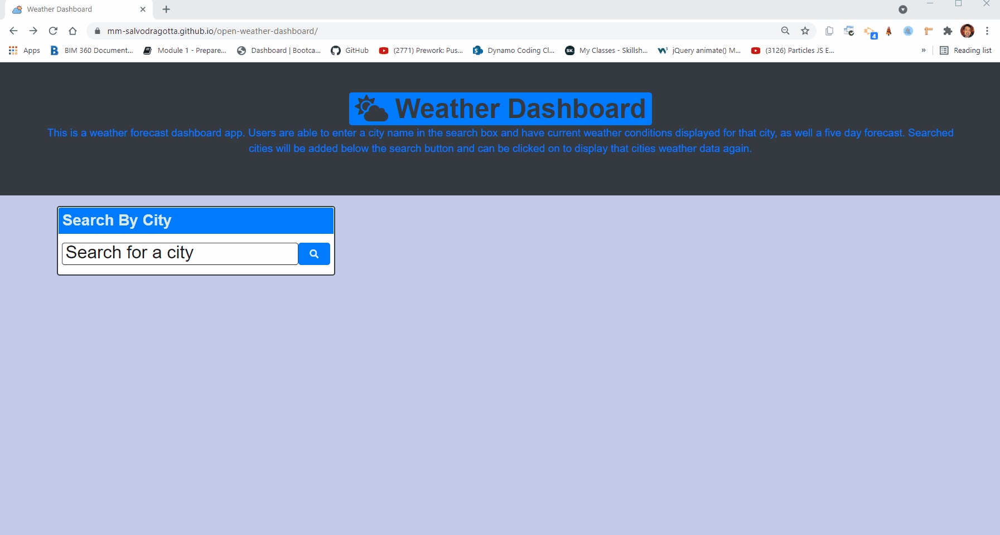

# OpenWeather Dashboard

## Weather Dashboard

This is a weather forecast dashboard app. Users are able to enter a city name in the search box and have current weather conditions displayed for that city, as well a five day forecast. Searched cities will be added below the search button and can be clicked on to display that cities weather data again.

You can view the deployed Weather Dashboard at this link. [Work Day Scheduler](https://mm-salvodragotta.github.io/open-weather-dashboard/).

## Tech Used
* [OpenWeather API](https://openweathermap.org/api)
* Javascript
* HTML
* CSS
* Bootstrap
* Moment.js
* Google Fonts
* Font Awesome

## Mock-Up

The following animation shows the web application's appearance and functionality:

- - -
© 2021. Confidential and Proprietary. All Rights Reserved.